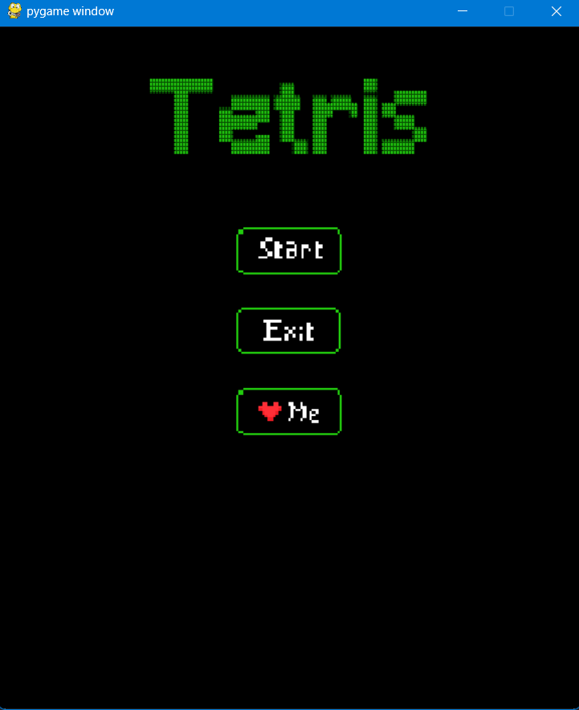
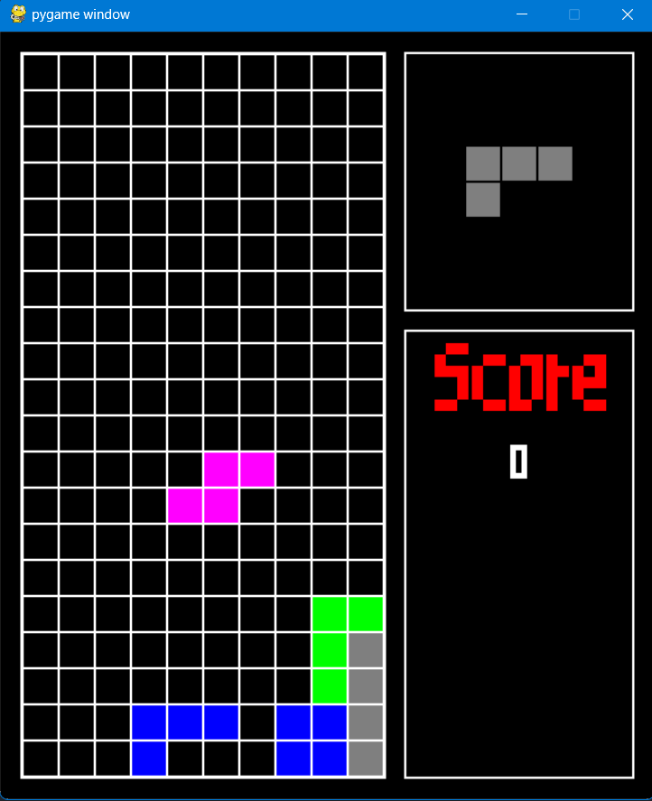

# Tetris
This is a simple Tetris game built using Pygame. The game features classic Tetris gameplay, where the player must rotate and move falling blocks to form horizontal lines on the game board. The game includes a home screen, sound effects, and a game-over screen with score tracking. The game also allows the user to view the next block and restart the game after it is over.
<hr>

## Libraries Used
1. **Pygame:** Used to handle graphics, input, and sound effects.
2. **Random:** Used to generate random blocks and colors.
3. **Webbrowser:** Used to open the web browser for social media links.

## Prerequisites

- Python 3.x
- pygame
```commandline
pip install pygame
```
- A modern web browser (optional, for opening social links)
<hr>

## Setup Instructions
### 1. Clone Repository
```commandline
git clone https://github.com/yourusername/tic-tac-toe-multiplayer.git
cd Tetris
```

### 2. Install Dependencies
```commandline
pip install pygame
```

### 3. Running the Game
To start the game, use the following command:
```commandline
python main.py
```
<hr>

## Data Structures Used
**1. 2D Lists**

The game board and the blocks are represented as 2D lists. The board is a list of 20 rows, each containing 10 columns.
Each block pattern is a 2D list where 1 represents a filled part of the block, and 0 represents an empty space.

**2. Dictionaries**

The buttons on the home screen (Start, Exit, and Like) are stored in a dictionary that maps button names to images used for the button’s normal and hover states.

**3. Tuples**

Used for storing RGB color values for the blocks, such as (255, 0, 0) for red and (0, 255, 0) for green.

<hr>



